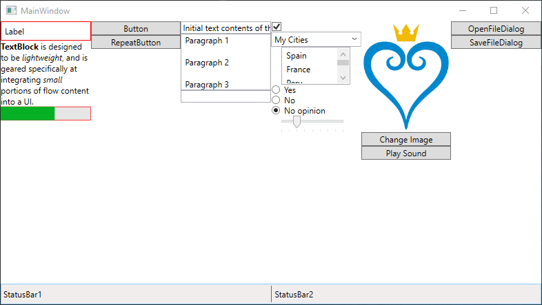

# [WPF Book](../readme.md)

# Controls
Controls are the building blocks of the app. WPF has a bunch of controls with varied features: Labels, Buttons, Tables, Menus and Layouts are also Controls.

[Official Documentation: Control List](https://learn.microsoft.com/en-us/dotnet/desktop/wpf/controls/controls-by-category?view=netframeworkdesktop-4.8)

Check the code at ControlsSample.xaml

## Display Controls
Here I'll list some controls that display information and are not usually used to interact with the user.

### Label
Displays the given text. The formatting applies to all of the text.

### TextBlock
A more advanced way of displaying text. Text can be formatted and can wrap to the next line if it runs out of space.

### Progressbar
A simple progress bar. A "Minumum", "Maximum" and "Value" can be set.

### StatusBar
Used as a container to place "StatusBarItem" objects that contain information. Items can be separated using a "Separator". Usually placed at the bottom of the Window. The placement of the items can be defined by using "ItemsPanelTemplate".

## Buttons
Clickable buttons that do actions when clicked.

### Button
Buttons raise events when clicked. The function called is defined in the "Click" property and must be implemented in the cs file.

### RepeatButton
Same as the Buttons but raises their Click event every X milliseconds, defined in the "Interval" property, until it's released. Can also define a "Delay" for the first time the event is called.

## Text Input
Boxes to input text.

### TextBox
A box to input unformatted text. Can trigger an event when the text is changed by using the "TextChanged" property.

### RichTextBox
A TextBox that allows formatting. Its only child must be a "FlowDocument".

### PasswordBox
A TextBox that hides the input characters, showing them as the character specified in "PasswordChar".

## Selection Controls
Allows the user to select from a set list of options.

### CheckBox
A simple checkbox. Can trigger events with "Checked" and "Unchecked". "IsChecked" controls the inital value.

### ComboBox
A combobox or dropdown menu with multiple options where one can be selected. The options are stored in "ItemsSource". "Text" sets the default, unselected, value.

### ListBox
Similar to a ComboBox but the options are shown as a scrollable list and multiple can be selected. "SelectionMode" can be set to "Single".

### RadioButton
RadioButtons work as grouped CheckBoxes were only one of them can be set at a given time. To group RadioButtons add them all to the same parent.

### Slider
A Slider to select a value between 2 values.

- Can set "Minimum", "Maximum" and "Value" for the initial value.
- Can add visual dividers with "TickPlacement" and "TickFrequency".
- Can set "IsSnapToTickEnabled" to force the slider into the tick values.
- Can add events on start, end and when the value changes with "Thumb.DragStarted", "Thumb.DragCompleted" and "ValueChanged".

## Media
WPF supports some formats of image, video and sound. Note that any file that is loaded in the project must change its "Build Action" property to "Resource".

### Image
Inserts an image. BitmapImages can be set as Source.

Can be loaded dynamically:

    <Image Source="../Media/image.png"/>

Or as a static resource:

    <Image Source="{StaticResource imageResource}"/>

### SoundPlayerActions
A SoundPlayerAction can be assigned via an EventTrigger to play sounds.

    <UserControl.Triggers>
        <EventTrigger RoutedEvent="Button.Click" SourceName="buttonName">
            <EventTrigger.Actions>
                <SoundPlayerAction Source="media\mySound.wav"/>
            </EventTrigger.Actions>
        </EventTrigger>
    </UserControl.Triggers>

Note: In C# SoundPlayer objects can be used to play sounds, they can be passed a stream of the file for this.

## Dialog Boxes
Dialog boxes allows the user to read and write files. These can't be added into xaml files but can be called from the code-behind.

### OpenFileDialog
Opens a dialog that lets the user choose a file or files to read.

### SaveFileDialog
Opens a dialog that lets the user choose a file or files to write.