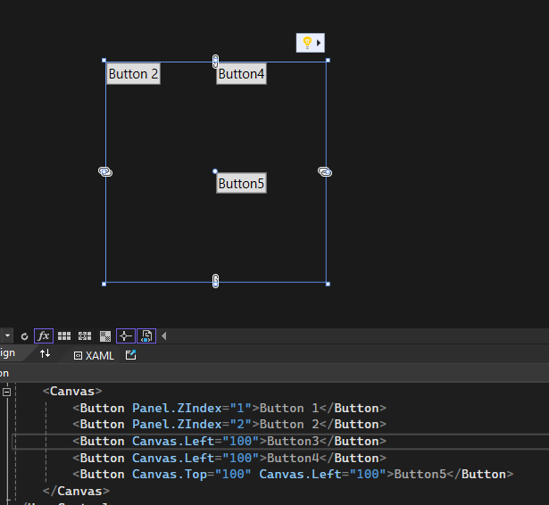
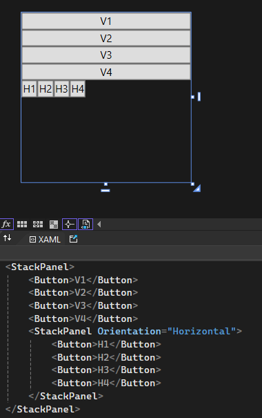
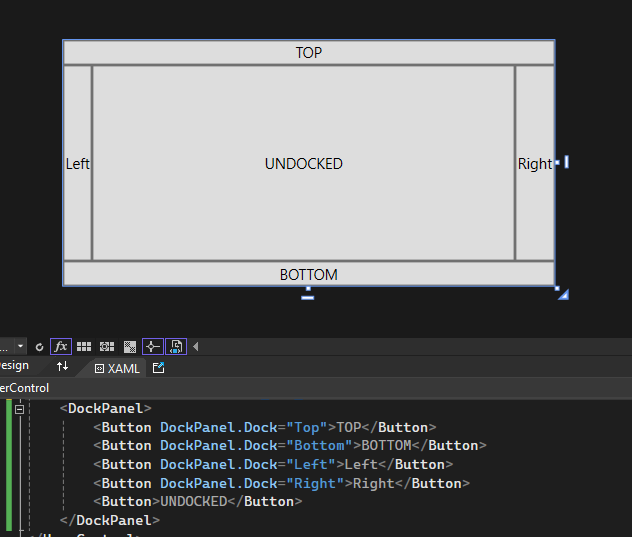
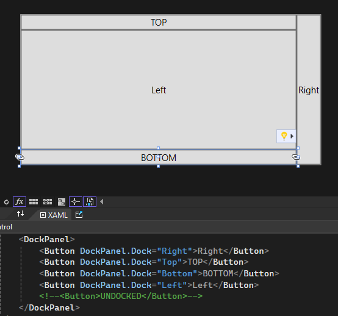
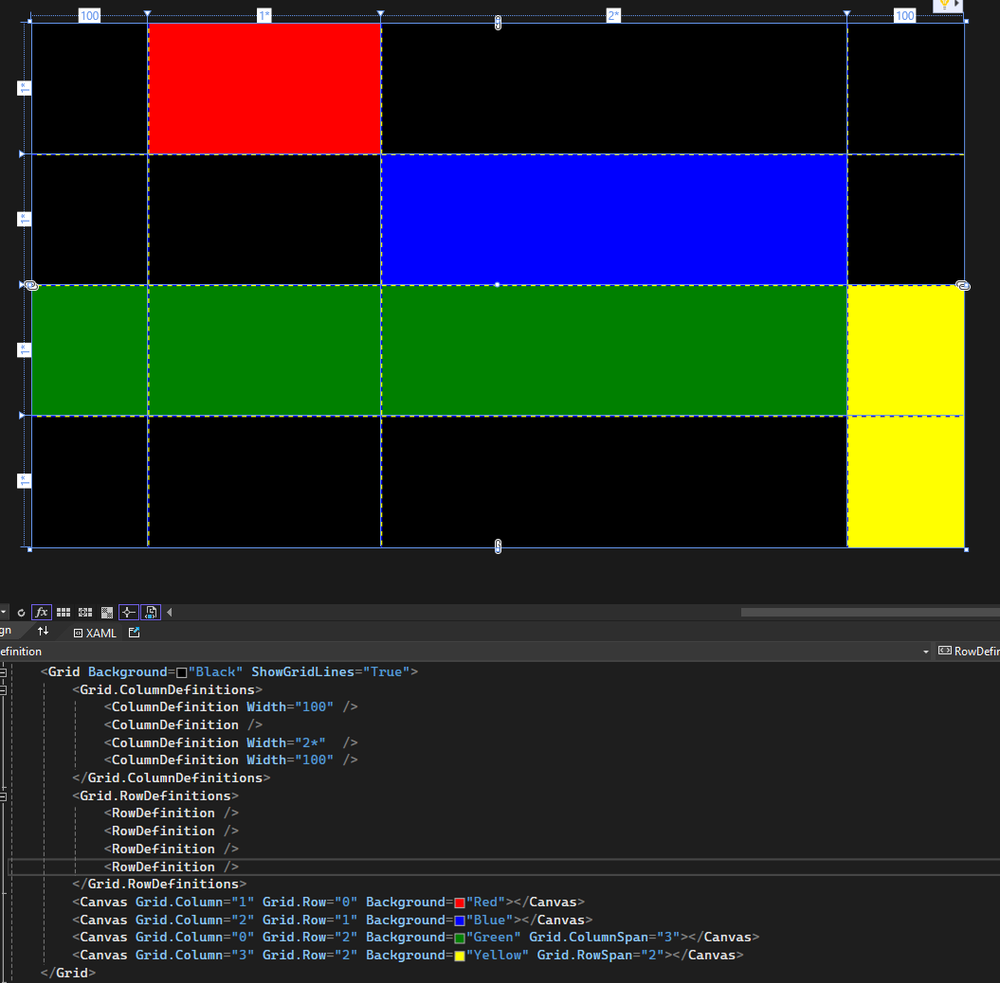
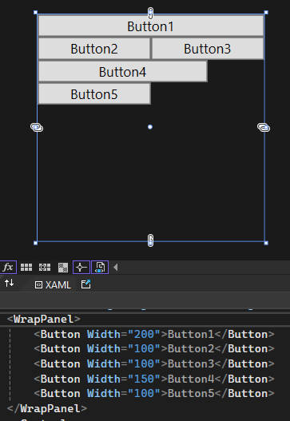

# [WPF Book](../readme.md)

## Panel Layouts
Panels control how the content of the app is structured.

[Official Documentation: Panels](https://learn.microsoft.com/en-us/dotnet/desktop/wpf/controls/panels-overview?view=netframeworkdesktop-4.8)

### Canvas
The simplest of panels. It has no special characteristics.

- Components are always positioned at <0,0> (Top left) unless specified.
- If components overlap, the last one or the one with the highest "ZIndex" value will be displayed on top.
- Content will not resize.

### StackPanel
StackPanels display their components in order one after the other.

- By default components are ordered vertically. This can be changed through the property "Orientation";
- Components do not fill the parent StackPanel.
- Components DO overflow. To be able to scroll they need to be wrapped in a ScrollViewer.

### DockPanel
DockPanel allows to place content on the borders of the parent container. Components that are not docked will be placed in the center.

- If no component is undocked, the last docked component wil fill the center. (LastChildFill is true by default)
- For the corners, The highest placed component will have priority.

### Grid
Grids define columns and rows where the components will be placed.

- Requires ColumnDefinitions and/or RowDefinitions.
- One component can span multiple columns/rows.
- An astersik can be used to represent "remaining size" (Default). If multiple components use the asterisk, their size will be evenly split (Unless specified by multiples of asterisk)
- A component can span multiple cells throught the properties "ColumnSpan" and "RowSpan".

### WrapPanel
WrapPanels display components horizontally (default) until it reaches its width's size, then it wraps to a "new line". Orientation can be changed to vertical.

